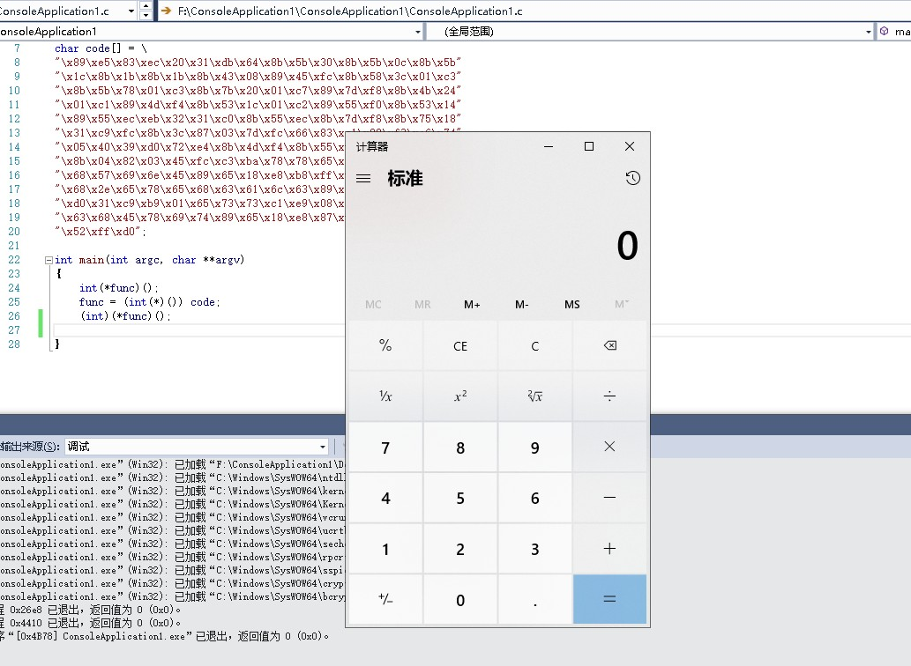
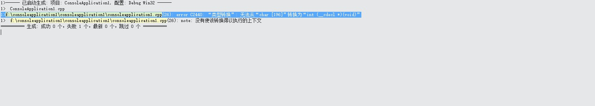
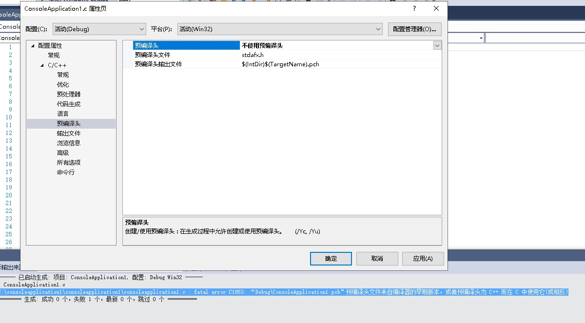
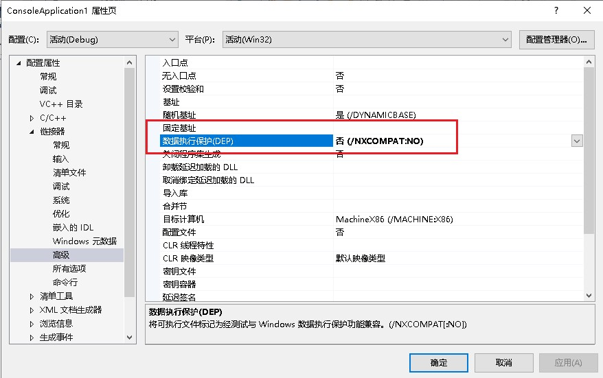
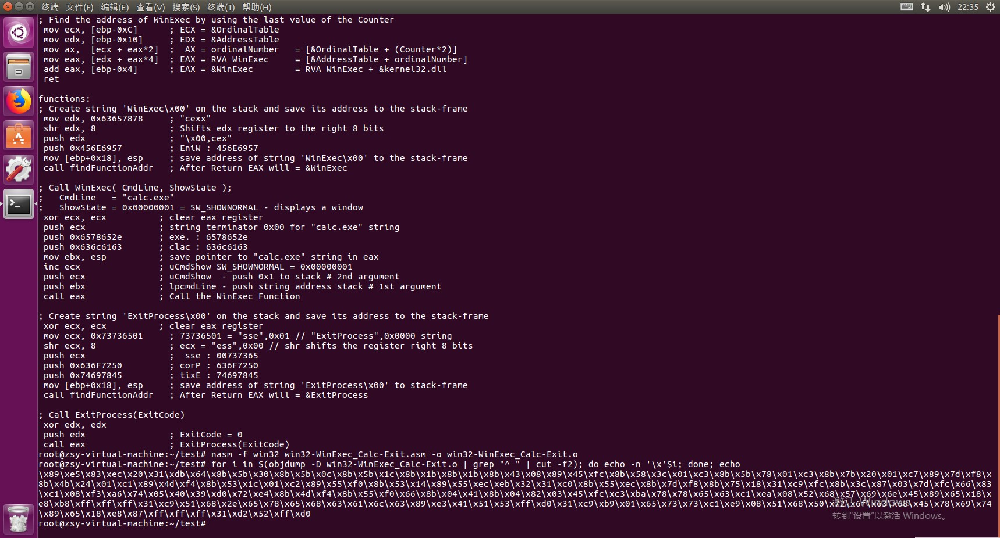
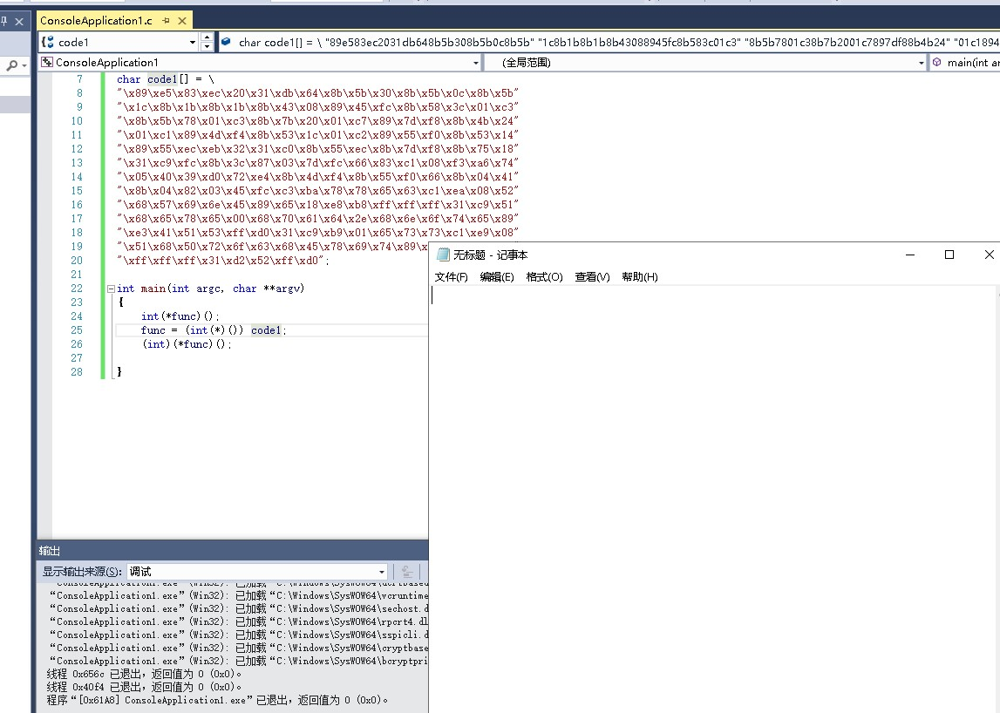

# 逆向工程与软件安全实验报告  
## shellcode相关
### 实验任务  
- [x] 给出shellcode能够成功运行  
- [x] 能从汇编源码编译通过并成功dump  
- [x] 搜索Windows PEB结构体，PE文件导入表导出表相关数据结构的文档，解读shellcode原理  
- [x] 修改shellcode功能为运行记事本程序notepad.exe  
- [] (选做)修改shellcode功能为下载执行器，即下下载一个可执行文件，然后再运行  

### 实验过程  

##### shellcode能够成功运行  
[shellcode源代码](https://www.exploit-db.com/shellcodes/48116)  

运行calc.exe成功shellcode

```C
#include <windows.h>
#include <stdio.h>

char code[] = \
"\x89\xe5\x83\xec\x20\x31\xdb\x64\x8b\x5b\x30\x8b\x5b\x0c\x8b\x5b"
"\x1c\x8b\x1b\x8b\x1b\x8b\x43\x08\x89\x45\xfc\x8b\x58\x3c\x01\xc3"
"\x8b\x5b\x78\x01\xc3\x8b\x7b\x20\x01\xc7\x89\x7d\xf8\x8b\x4b\x24"
"\x01\xc1\x89\x4d\xf4\x8b\x53\x1c\x01\xc2\x89\x55\xf0\x8b\x53\x14"
"\x89\x55\xec\xeb\x32\x31\xc0\x8b\x55\xec\x8b\x7d\xf8\x8b\x75\x18"
"\x31\xc9\xfc\x8b\x3c\x87\x03\x7d\xfc\x66\x83\xc1\x08\xf3\xa6\x74"
"\x05\x40\x39\xd0\x72\xe4\x8b\x4d\xf4\x8b\x55\xf0\x66\x8b\x04\x41"
"\x8b\x04\x82\x03\x45\xfc\xc3\xba\x78\x78\x65\x63\xc1\xea\x08\x52"
"\x68\x57\x69\x6e\x45\x89\x65\x18\xe8\xb8\xff\xff\xff\x31\xc9\x51"
"\x68\x2e\x65\x78\x65\x68\x63\x61\x6c\x63\x89\xe3\x41\x51\x53\xff"
"\xd0\x31\xc9\xb9\x01\x65\x73\x73\xc1\xe9\x08\x51\x68\x50\x72\x6f"
"\x63\x68\x45\x78\x69\x74\x89\x65\x18\xe8\x87\xff\xff\xff\x31\xd2"
"\x52\xff\xd0";

int main(int argc, char **argv)
{
  int (*func)();
  func = (int(*)()) code;
  (int)(*func)();
}
```  

  

## 编译问题及解决
1. 源代码必须是.c文件，否则会出现类型转换错误
 
  




2. 关闭数据执行保护编译选项  

  
    


##### 能从汇编源码编译通过并成功dump  
Ubuntu虚拟机中新建`win32-WinExec_Calc-Exit.asm`  
将汇编源码加入`.asm`文件  
```
nasm -f win32 win32-WinExec_Calc-Exit1.asm -o win32-WinExec_Calc-Exit1.o  
for i in $(objdump -D win32-WinExec_Calc-Exit1.o | grep "^ " | cut -f2); do echo -n '\x'$i; done; echo  
```  
  

##### 解读shellcode原理  
[PEB结构体](https://docs.microsoft.com/en-us/windows/win32/api/winternl/ns-winternl-peb)  


##### 修改shellcode功能为运行记事本程序notepad.exe  

runnotepad.c文件  

```C
#include <windows.h>
#include <stdio.h>
//生成notepad.exe
char code1[] = \
"\x89\xe5\x83\xec\x20\x31\xdb\x64\x8b\x5b\x30\x8b\x5b\x0c\x8b\x5b"
"\x1c\x8b\x1b\x8b\x1b\x8b\x43\x08\x89\x45\xfc\x8b\x58\x3c\x01\xc3"
"\x8b\x5b\x78\x01\xc3\x8b\x7b\x20\x01\xc7\x89\x7d\xf8\x8b\x4b\x24"
"\x01\xc1\x89\x4d\xf4\x8b\x53\x1c\x01\xc2\x89\x55\xf0\x8b\x53\x14"
"\x89\x55\xec\xeb\x32\x31\xc0\x8b\x55\xec\x8b\x7d\xf8\x8b\x75\x18"
"\x31\xc9\xfc\x8b\x3c\x87\x03\x7d\xfc\x66\x83\xc1\x08\xf3\xa6\x74"
"\x05\x40\x39\xd0\x72\xe4\x8b\x4d\xf4\x8b\x55\xf0\x66\x8b\x04\x41"
"\x8b\x04\x82\x03\x45\xfc\xc3\xba\x78\x78\x65\x63\xc1\xea\x08\x52"
"\x68\x57\x69\x6e\x45\x89\x65\x18\xe8\xb8\xff\xff\xff\x31\xc9\x51"
"\x68\x65\x78\x65\x00\x68\x70\x61\x64\x2e\x68\x6e\x6f\x74\x65\x89"
"\xe3\x41\x51\x53\xff\xd0\x31\xc9\xb9\x01\x65\x73\x73\xc1\xe9\x08"
"\x51\x68\x50\x72\x6f\x63\x68\x45\x78\x69\x74\x89\x65\x18\xe8\x82"
"\xff\xff\xff\x31\xd2\x52\xff\xd0";

int main(int argc, char **argv)
{
	int(*func)();
	func = (int(*)()) code1;
	(int)(*func)();

}
```  
  
  

