# 实验：加密计事本保存内容

## 实验环境

* windows 10
* visual studio 2008

## 实验原理

**加密计算本保存的内容**核心原理包括三部分

1.利用API HOOk技术截获WriteFile，通过加密WriteFile的lpBuffer指针中的内容，达到加密的目的。

2.利用消息钩子向计事本中注入一个动库，以便HOOK操作得以执行。

3.HOOK技术使用了IAT HOOK方式，在动态库加载时，执行挂钩操作。

## 实验过程

### 1. 挂钩API分

根据操作系统提供的文件系统API，应用程序编写者一般采用WriteFile函数向文件中写入数据，采用WinDbg下断点可以确定这一点，也可以使用PE Explorer查看模块间的依赖关系。

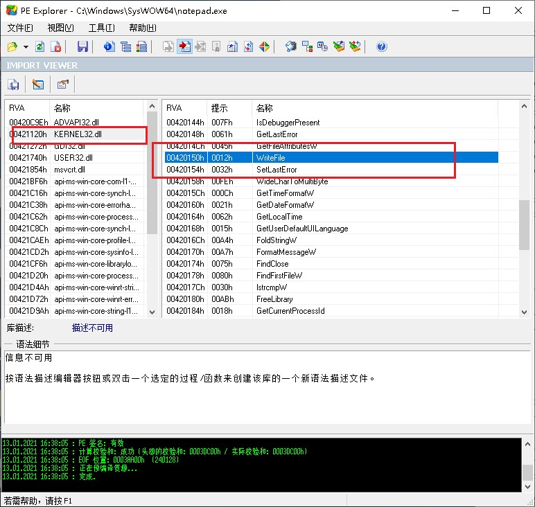
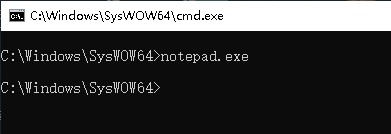

### 2. 注入程序编写

注入程序需要完成动态库的注入，因此，需要使用系统API SetWindowHookEx来实现。又因为注入其他进程需要使用全局钩子，因此，具体的实现代码需要写到动态库中。

注入使用了WH_CBT类型的钩子，可以在应用启动时，向进程注入钩子。
注入的过程是由操作系统提供的，注入程序只需要调用SetWindowHookEx函数即可。

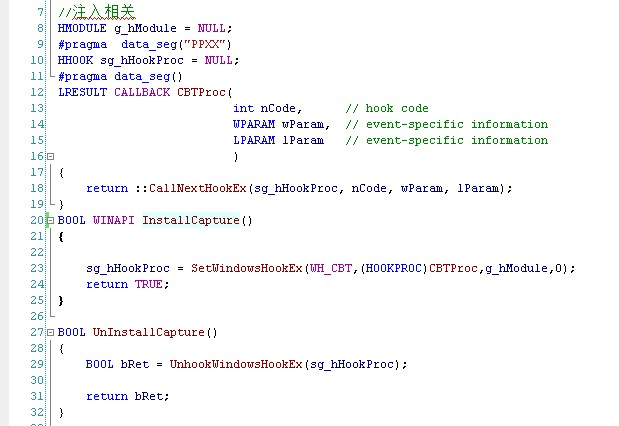	

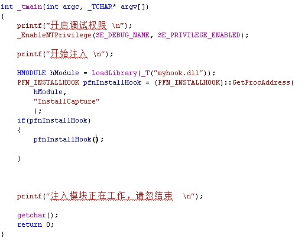

### 3. 编写Hook动态库

动态库提供了入口函数DllMain，当应用程序加载时会自动执行，因此在DllMain中处理IAT Hook和unHook。

Hook的过程是利用IAT技术，修改IAT表，中的地址为MyWriteFile，并保存原地址至pfnMyWriteFile
UnHook的过程是恢复IAT表的地址。
因为IAT表在程序中是只读的，所以修改IAT表时，需要先修改IAT表为读写属性，完成修改之后，需要恢复为只读属性。

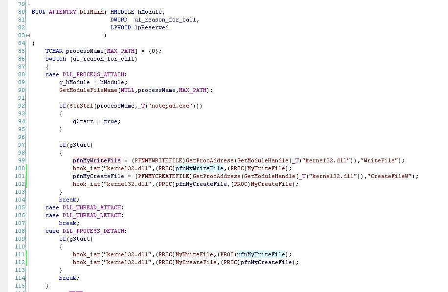

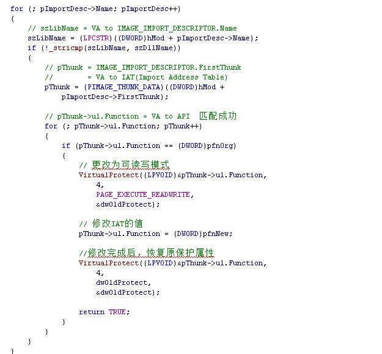

### 4. 编写钩子功能

钩子功能，为了实现加密，因此，先先简单的异或按字加处理一下。为了防止对特定文件（change.txt）处理，增加了CreateFileW的钩子记录下要处理的文件。

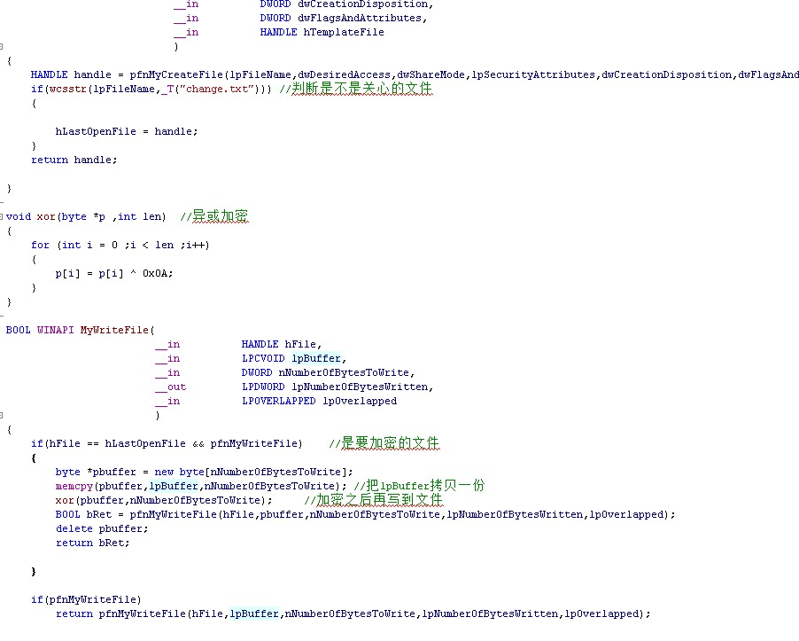

### 5. 演示
1.启动钩子注入程序（injectNotepad.exe）

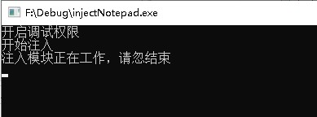

2.启动notepad.exe,打开change.txt,输入“111111”,保存前的内容

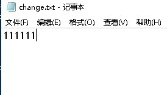

2.保存后，重新打开

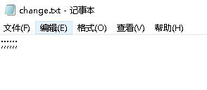

## 实验参考
https://github.com/DarthTon/Xenos
https://github.com/fdiskyou/injectAllTheThings

## 问题与解决 

1.如何区分打开的文件是否为change.txt
解决方案：通过搜索发现操作系统并末直接提供通过文件句柄获取文件名的API，但根据WriteFile的MSDN说明，第一个参数文件句柄，需要使用CreateFile打开，因此，在CreateFile中记录句柄就能达到目的。

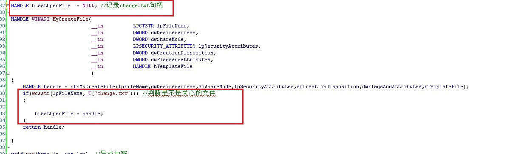

2.CreateFile Hook时一直失败
解决方案：查看依赖关系时，发现notepad.exe使用的是CreateFileW

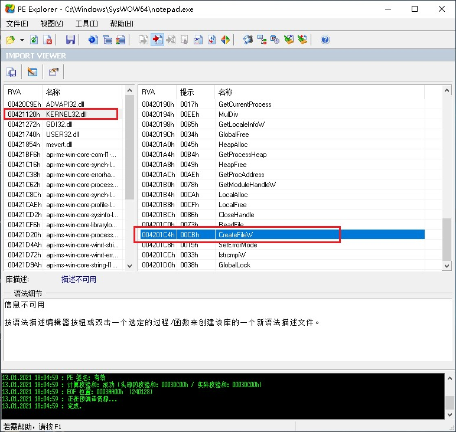

3.设置挂钩不生效
解决方案：通过对比发现，挂钩需要开启相应权限

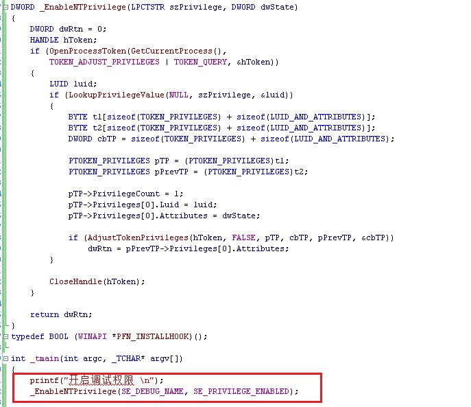
